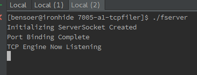
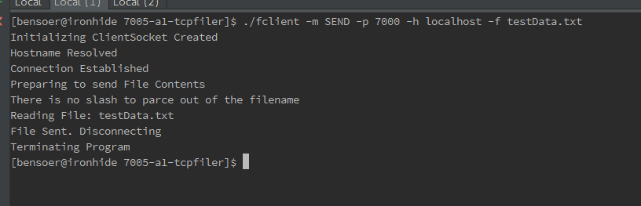
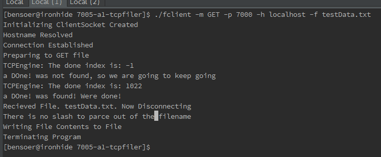

#7005-a1-tcpfiler

##Setup

All Compiling and Running is assumed to be executed from the project root

###To Compile

Compile the Server 
`g++ -pedantic -Wall -W -o fserver server/fileServer.cpp  utils/tcpengine.cpp utils/filehelper.cpp`  
Compile the Client 
`g++ -pedantic -Wall -W -o fclient client/fileClient.cpp  utils/tcpengine.cpp utils/filehelper.cpp`

###To Run

Run the Server 
`./fserver`  

To GET with the client 
`./fclient -m GET -p 7000 -h localhost -f testData.txt`  

To SEND with the client 
`./fclient -m SEND -p 7000 -h localhost -f testData.txt`

####Parameters
* -p The port number to make the connection to. Server is hardcoded to 7000
* -h The IP of the server being connected to.
* -m The mode of the task the client is doing. Options are `SEND` and `GET`

###Tests

Tests executed by using a sample text file called textData.txt and transferring it between the `data` and `upload` folder
. Data is used to represent the clients local directory, and the Upload folder is used as the servers local file directories.
All file parameters use a relative path from these directory locations.

Server is started as such   

Then Calling the SEND Route several times to ensure buffer clearing. When calling send remember to remove the file from
the uploads folder and make sure the file you want to send (testData.txt) is in the data folder. 
Make sure not to delete the uploads folder itself, only its file contents. Execute the call to SEND
and then view the file in the uploads folder. The data should be identicle to the file from the data folder
  

Then Calling the GET Route several times to ensure buffer clearing. When calling get remember to remove the file from
the data folder and make sure the file you want to send (testData.txt) is in the upload folder. 
Make sure not to delete the data folder itself, only its file contents. Execute the call to SEND
and then view the file in the data folder. The data should be identicle to the file from the uploads folder
  

###Design Docs - Finite State Diagram
See 7005-A1-FSM.pdf for Finite State Machine Diagram Designs for the fileClient.cpp and fileServer.cpp